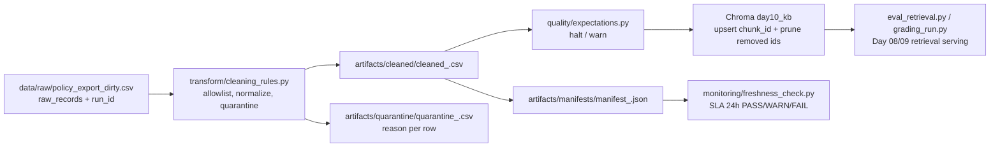

# Kiến trúc pipeline — Lab Day 10

**Nhóm:** AI in Action Day 10 lab team  
**Cập nhật:** 2026-06-10

---

## 1. Sơ đồ luồng (bắt buộc có 1 diagram: Mermaid / ASCII)

> Vẽ thêm: điểm đo **freshness**, chỗ ghi **run_id**, và file **quarantine**.

---

## 2. Ranh giới trách nhiệm

| Thành phần | Input | Output | Owner nhóm |
|------------|-------|--------|--------------|
| Ingest | `data/raw/policy_export_dirty.csv` | Raw rows, `raw_records`, `run_id` log | Ingestion Owner |
| Transform | Raw rows | Cleaned CSV + quarantine CSV | Cleaning Owner |
| Quality | Cleaned rows | Expectation result, controlled halt | Quality Owner |
| Embed | Cleaned CSV | Chroma collection `day10_kb` | Embed Owner |
| Monitor | Manifest JSON | Freshness status and SLA detail | Monitoring Owner |

---

## 3. Idempotency & rerun

Embed dùng `col.upsert(ids=chunk_id, ...)`, nên rerun cùng cleaned data không tạo duplicate vector. Trước upsert, pipeline đọc ids hiện có trong collection và `delete` các ids không còn trong cleaned snapshot. Vì vậy run `inject-bad` có thể làm xấu index để demo, nhưng run chuẩn `after-fix` sẽ prune lại các ids stale.

---

## 4. Liên hệ Day 09

Pipeline này là tầng publish dữ liệu trước retrieval cho case CS + IT Helpdesk của Day 08/09. Day 09 agent có thể đọc cùng collection Chroma `day10_kb` hoặc dùng cùng cleaned CSV để rebuild collection riêng. Điểm quan trọng là agent chỉ nên đọc snapshot đã pass expectation, có manifest/run_id rõ ràng.

---

## 5. Rủi ro đã biết

- Freshness hiện `FAIL` với manifest `after-fix` vì latest export là `2026-04-11T00:00:00`, đã quá SLA 24h vào ngày chạy `2026-06-10`.
- Eval tự kiểm 21 câu và grading chính thức 10 câu đều pass ở snapshot `after-fix`.
- Nếu thêm nguồn mới, phải cập nhật đồng thời `ALLOWED_DOC_IDS`, contract, expectation `required_doc_ids_present`, và câu hỏi eval.
